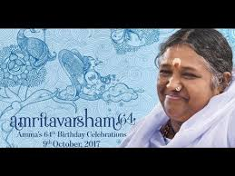
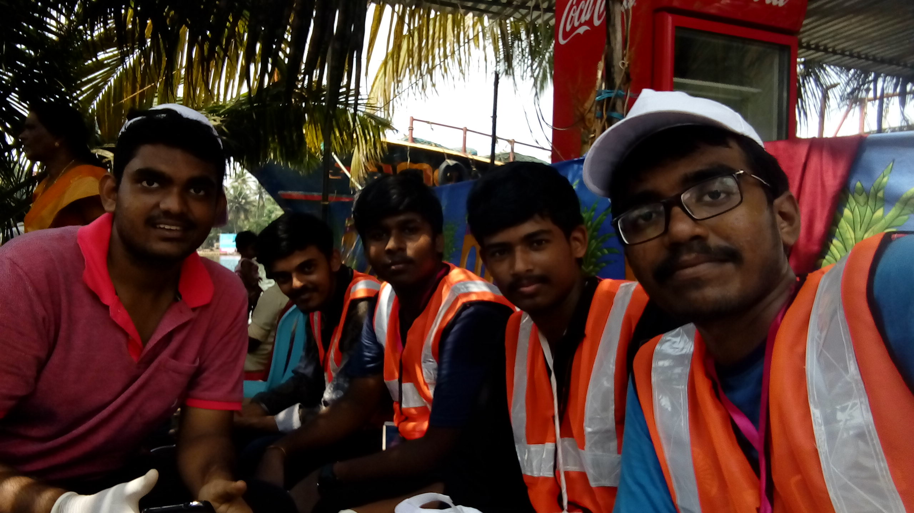
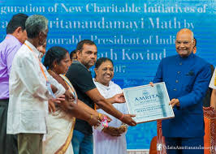

# About Amma:

Mātā Amṛtānandamayī is an Indian [guru](https://en.wikipedia.org/wiki/Guru "Guru") from Parayakadavu (now partially known as [Amritapuri](https://en.wikipedia.org/wiki/Amritapuri "Amritapuri")), [Alappad](https://en.wikipedia.org/wiki/Alappad "Alappad") Panchayat, [Kollam District](https://en.wikipedia.org/wiki/Kollam_District "Kollam District"), in the state of [Kerala](https://en.wikipedia.org/wiki/Kerala "Kerala"). Born to a family of fishermen in 1953, she was the third child of Sugunanandan and Damayanti. She has six siblings.

Embracing the World, Amma's network of charity organizations, provides food, housing, education, and medical services for the poor. This global network exists in 40 countries around the world, and has built and/or supported schools, orphanages, housing, and hospitals throughout India. In the United States, the organization has provided soup kitchens and hot showers for the homeless, books and hospital visits for prison inmates, and support for victims of domestic violence.

 The organization also raised $1 million in aid for "[Hurricane Katrina](https://en.wikipedia.org/wiki/Hurricane_Katrina "Hurricane Katrina")" victims. The hospital located on the territory of Amma's [ashram](https://en.wikipedia.org/wiki/Ashram "Ashram") in Kerala offers medical care on a sliding scale, allowing people to pay what they can afford. This is often a minimal percent of the total medical cos

 

MATA AMRITANANDAMAYI DEVI alias "AMMA", her birthday celebrations were celebrated  on october 9th. This is my first time experience of this event.As a student of Amrita university and as a CSE student I participated in VENUE MAINTENANCE seva. It is a great experience here working with friends and taking part in this divine festival.               It's the 64th birthday of her birthday when the whole campus was full of devotees and stalls.the campus was colorful with lights and people I can never forget such an amazing celebration.

\[gallery ids="112,113,114" type="rectangular"\]

I am in the seva of maintaining  the Area from  Biotech block  to the bridge. We worked as a team of 17 members for maintaining the area clean. we woked for three days joyfully and I am very happy for being a part of this celebration.

It is a great time with my friends enjoying the seva and I loved working with my friends.We were very grateful to see our president "Mr.RAM NATH KOVIND" in our campus @AMRITA UNIVERSITY Amirtapuri.

##  

FEELING VERY BLESSED FOR STUDYING IN SUCH A UNIVERSITY RUN BY A GREAT PERSOM LIKE AMMA.
